# thsr-ticket-manager - Task 4

Execute task 4 for the thsr-ticket-manager specification.

## Task Description
建立車票紀錄型別 🔄

## Requirements Reference
**Requirements**: 1.2, 1.3, 1.4, 2.3, 2.4

## Usage
```
/Task:4-thsr-ticket-manager
```

## Instructions

Execute with @spec-task-executor agent the following task: "建立車票紀錄型別 🔄"

```
Use the @spec-task-executor agent to implement task 4: "建立車票紀錄型別 🔄" for the thsr-ticket-manager specification and include all the below context.

# Steering Context
## Steering Documents Context

No steering documents found or all are empty.

# Specification Context
## Specification Context (Pre-loaded): thsr-ticket-manager

### Requirements
# Requirements Document

## Introduction

高鐵車票管理工具是一個 Web 應用程式，幫助經常搭乘高鐵出差的使用者管理車票紀錄。透過拍照或上傳車票圖片的方式，自動提取車票資訊（票號、搭乘時間、方向），並提供手動輸入出差目的的功能，方便雙月底報帳時下載憑證。

## Alignment with Product Vision

此功能解決了出差族群在報帳時需要手動紀錄車票資訊的痛點，透過 OCR 技術自動化提取資訊，減少人工輸入錯誤，提升報帳效率。

## Requirements

### Requirement 1: 車票圖片上傳與 OCR 辨識

**User Story:** As a 經常搭高鐵出差的員工, I want 透過拍照或上傳車票圖片來記錄車票資訊, so that 不需要手動抄寫車票號碼和時間

#### Acceptance Criteria

1. WHEN 使用者上傳車票圖片 THEN 系統 SHALL 接受 JPG、PNG、HEIC 格式的圖片
2. WHEN 圖片上傳成功 THEN 系統 SHALL 使用 OCR 技術提取車票號碼
3. WHEN OCR 辨識完成 THEN 系統 SHALL 提取搭乘日期與時間
4. WHEN OCR 辨識完成 THEN 系統 SHALL 辨識乘車方向（台北→左營 或 左營→台北）
5. IF OCR 辨識結果不確定 THEN 系統 SHALL 允許使用者手動修正
6. WHEN 使用者使用手機瀏覽 THEN 系統 SHALL 支援直接開啟相機拍照

### Requirement 2: 車票紀錄管理

**User Story:** As a 需要報帳的員工, I want 管理我的車票紀錄清單, so that 可以在報帳時快速查詢所有車票

#### Acceptance Criteria

1. WHEN 車票資訊提取成功 THEN 系統 SHALL 自動建立一筆車票紀錄
2. WHEN 建立車票紀錄時 THEN 系統 SHALL 允許使用者輸入出差目的/備註
3. WHEN 使用者查看紀錄清單 THEN 系統 SHALL 顯示票號、日期、方向、目的
4. WHEN 使用者篩選紀錄 THEN 系統 SHALL 支援按月份、方向篩選
5. IF 使用者要編輯紀錄 THEN 系統 SHALL 允許修改所有欄位
6. IF 使用者要刪除紀錄 THEN 系統 SHALL 要求確認後刪除

### Requirement 3: 資料持久化與雲端同步

**User Story:** As a 經常搭高鐵出差的員工, I want 我的車票紀錄能同步到 Google 雲端硬碟, so that 可以在不同裝置間存取，且不怕資料遺失

#### Acceptance Criteria

1. WHEN 使用者首次使用 THEN 系統 SHALL 提供 Google 帳號登入選項
2. WHEN 使用者授權 Google Drive 存取 THEN 系統 SHALL 在雲端建立專屬資料夾儲存紀錄
3. WHEN 車票紀錄建立或修改 THEN 系統 SHALL 自動同步至 Google Drive
4. WHEN 使用者在新裝置登入 THEN 系統 SHALL 從 Google Drive 載入所有紀錄
5. IF 使用者未登入 Google THEN 系統 SHALL 使用本機儲存作為備援
6. IF 網路斷線 THEN 系統 SHALL 暫存變更，待連線後自動同步
7. IF 使用者要匯出資料 THEN 系統 SHALL 支援匯出為 CSV 格式

### Requirement 4: 憑證下載輔助（Phase 2 - 待研究）

**User Story:** As a 需要報帳的員工, I want 能快速取得高鐵憑證, so that 不需要手動一張一張到網站下載

#### Acceptance Criteria

1. WHEN 使用者選擇車票紀錄 THEN 系統 SHALL 提供高鐵憑證下載頁面連結
2. WHEN 使用者點擊連結 THEN 系統 SHALL 開啟新視窗至高鐵網站
3. WHEN 可行時 THEN 系統 SHALL 自動帶入票號參數（需研究高鐵網站 API）

## Non-Functional Requirements

### Performance
- OCR 辨識應在 5 秒內完成
- 頁面載入時間應在 2 秒內
- 支援離線瀏覽已儲存的紀錄

### Security
- 車票圖片僅儲存在使用者本機或其個人 Google Drive，不上傳至第三方伺服器
- OCR 處理應在客戶端進行或使用安全的 API
- Google Drive 存取應使用 OAuth 2.0 授權，僅請求必要的權限範圍
- 使用者可隨時撤銷 Google 授權

### Reliability
- 本機儲存應防止資料遺失
- 支援資料匯出備份

### Usability
- 支援響應式設計，適配手機與桌面瀏覽器
- 拍照/上傳流程應在 3 步內完成
- 介面支援繁體中文

### Compatibility
- 支援紙本車票 OCR 辨識
- 支援高鐵 T-EX App 電子票截圖 OCR 辨識

---

### Design
# Design Document

## Overview

高鐵車票管理工具是一個純前端 Web 應用，使用 React + Vite 建構。核心功能包括：
1. 使用 Tesseract.js 在瀏覽器端進行 OCR 辨識
2. 使用 Google Drive API 進行雲端同步
3. 使用 IndexedDB 作為本機快取

## Steering Document Alignment

### Technical Standards
- 使用 TypeScript 確保類型安全
- 採用 React 函數式元件 + Hooks
- 使用 Tailwind CSS 進行樣式設計

### Project Structure
```
src/
├── components/     # UI 元件
├── hooks/          # 自定義 Hooks
├── services/       # 業務邏輯（OCR、Google Drive）
├── stores/         # 狀態管理
├── types/          # TypeScript 型別定義
└── utils/          # 工具函數
```

## Image Processing

### 支援格式
- **JPG/JPEG** - 直接處理
- **PNG** - 直接處理
- **HEIC** - iPhone 照片格式，使用 `heic2any` 函式庫轉換為 JPG 後處理

### 圖片處理流程

```mermaid
flowchart LR
    Upload[上傳圖片] --> Check{檢查格式}
    Check -->|JPG/PNG| OCR[OCR 辨識]
    Check -->|HEIC| Convert[heic2any 轉換]
    Convert --> OCR
    Check -->|其他| Error[顯示錯誤]
```


## Google Drive 資料結構

### 資料夾結構
```
我的雲端硬碟/
└── THSR-Ticket-Manager/
    └── tickets.json          # 所有車票紀錄 (JSON 格式)
```

### 同步策略
- **衝突解決**：採用 Last-Write-Wins 策略，以 `updatedAt` 時間戳為準
- **增量同步**：比對本機與雲端的 `updatedAt`，只同步有變更的紀錄
- **離線佇列**：離線時的變更存入待同步佇列，連線後依序處理

## Architecture

```mermaid
graph TD
    subgraph Frontend["前端應用 (React)"]
        UI[UI 元件層]
        Store[狀態管理 Zustand]
        Services[服務層]
    end

    subgraph Services["服務層"]
        OCR[OCR Service<br/>Tesseract.js]
        GDrive[Google Drive Service]
        Storage[Storage Service]
    end

    subgraph External["外部服務"]
        GDriveAPI[Google Drive API]
        LocalDB[(IndexedDB)]
    end

    UI --> Store
    Store --> Services
    OCR --> |圖片辨識| Store
    GDrive --> GDriveAPI
    Storage --> LocalDB
    Storage --> GDrive
```



## Components and Interfaces

### 1. App 主框架
- **Purpose:** 應用程式入口，處理路由和全域狀態
- **Interfaces:** 無外部 API
- **Dependencies:** React Router, Zustand Store

### 2. TicketUploader 車票上傳元件
- **Purpose:** 處理圖片上傳和相機拍照
- **Interfaces:**
  ```typescript
  interface TicketUploaderProps {
    onImageCapture: (file: File) => void;
    isProcessing: boolean;
  }
  ```
- **Dependencies:** 無

### 3. TicketOCRPreview OCR 預覽元件
- **Purpose:** 顯示 OCR 辨識結果，允許使用者修正
- **Interfaces:**
  ```typescript
  interface TicketOCRPreviewProps {
    ocrResult: OCRResult;
    onConfirm: (ticket: TicketRecord) => void;
    onCancel: () => void;
  }
  ```
- **Dependencies:** OCR Service

### 4. TicketList 車票清單元件
- **Purpose:** 顯示所有車票紀錄，支援篩選
- **Interfaces:**
  ```typescript
  interface TicketListProps {
    tickets: TicketRecord[];
    onEdit: (id: string) => void;
    onDelete: (id: string) => void;
  }
  ```
- **Dependencies:** Store

### 5. TicketCard 車票卡片元件
- **Purpose:** 顯示單張車票資訊
- **Interfaces:**
  ```typescript
  interface TicketCardProps {
    ticket: TicketRecord;
    onEdit: () => void;
    onDelete: () => void;
  }
  ```

### 6. FilterBar 篩選列元件
- **Purpose:** 按月份、方向篩選紀錄
- **Interfaces:**
  ```typescript
  interface FilterBarProps {
    onFilterChange: (filter: FilterOptions) => void;
    currentFilter: FilterOptions;
  }
  ```

### 7. GoogleAuthButton Google 登入按鈕
- **Purpose:** 處理 Google OAuth 登入/登出
- **Interfaces:**
  ```typescript
  interface GoogleAuthButtonProps {
    isLoggedIn: boolean;
    onLogin: () => void;
    onLogout: () => void;
  }
  ```

## Data Models

### TicketRecord 車票紀錄
```typescript
interface TicketRecord {
  id: string;                    // UUID
  ticketNumber: string;          // 車票號碼 (13碼)
  travelDate: string;            // 搭乘日期 YYYY-MM-DD
  travelTime: string;            // 搭乘時間 HH:mm
  direction: 'northbound' | 'southbound';  // 北上/南下
  departure: string;             // 起站
  destination: string;           // 迄站
  purpose: string;               // 出差目的
  imageUrl?: string;             // 車票圖片 (Base64 或 Blob URL)
  createdAt: string;             // 建立時間 ISO 8601
  updatedAt: string;             // 更新時間 ISO 8601
  syncStatus: 'synced' | 'pending' | 'local';  // 同步狀態
}
```

### OCRResult OCR 辨識結果
```typescript
interface OCRResult {
  ticketNumber: string | null;
  travelDate: string | null;
  travelTime: string | null;
  direction: 'northbound' | 'southbound' | null;
  departure: string | null;
  destination: string | null;
  confidence: number;            // 辨識信心度 0-1
  rawText: string;               // 原始辨識文字
}
```

### FilterOptions 篩選選項
```typescript
interface FilterOptions {
  month?: string;                // YYYY-MM 格式
  direction?: 'northbound' | 'southbound' | 'all';
  searchText?: string;           // 搜尋票號或目的
}
```

### UserState 使用者狀態
```typescript
interface UserState {
  isGoogleLoggedIn: boolean;
  googleUser: {
    email: string;
    name: string;
    picture: string;
  } | null;
  lastSyncTime: string | null;
}
```

## Services

### 1. OCRService - OCR 辨識服務
```typescript
class OCRService {
  // 初始化 Tesseract worker
  async initialize(): Promise<void>;

  // 辨識車票圖片
  async recognizeTicket(imageFile: File): Promise<OCRResult>;

  // 解析高鐵車票格式
  private parseTicketText(text: string): OCRResult;

  // 釋放資源
  async terminate(): Promise<void>;
}
```

### 2. GoogleDriveService - Google Drive 服務
```typescript
class GoogleDriveService {
  // Google OAuth 登入
  async login(): Promise<GoogleUser>;

  // 登出
  async logout(): Promise<void>;

  // 檢查授權狀態
  isAuthorized(): boolean;

  // 上傳/更新車票紀錄
  async syncTickets(tickets: TicketRecord[]): Promise<void>;

  // 下載所有車票紀錄
  async fetchTickets(): Promise<TicketRecord[]>;

  // 刪除車票紀錄
  async deleteTicket(ticketId: string): Promise<void>;
}
```

### 3. StorageService - 儲存服務
```typescript
class StorageService {
  // 儲存車票到 IndexedDB
  async saveTicket(ticket: TicketRecord): Promise<void>;

  // 讀取所有車票
  async getAllTickets(): Promise<TicketRecord[]>;

  // 更新車票
  async updateTicket(ticket: TicketRecord): Promise<void>;

  // 刪除車票
  async deleteTicket(id: string): Promise<void>;

  // 匯出為 CSV
  exportToCSV(tickets: TicketRecord[]): string;

  // 同步至 Google Drive
  async syncToCloud(): Promise<void>;
}
```

## Error Handling

### Error Scenarios

1. **OCR 辨識失敗**
   - **Handling:** 顯示錯誤訊息，提供手動輸入表單
   - **User Impact:** 使用者可手動填寫所有欄位

2. **Google 登入失敗**
   - **Handling:** 顯示錯誤訊息，繼續使用本機儲存
   - **User Impact:** 資料只儲存在本機

3. **雲端同步失敗**
   - **Handling:** 標記紀錄為 pending，背景重試
   - **User Impact:** 使用者看到「待同步」狀態

4. **網路斷線**
   - **Handling:** 切換至離線模式，使用 IndexedDB
   - **User Impact:** 可繼續使用，連線後自動同步

5. **圖片格式不支援**
   - **Handling:** 顯示支援格式提示
   - **User Impact:** 使用者重新選擇正確格式圖片

## User Flow

```mermaid
flowchart TD
    Start([開啟應用]) --> CheckAuth{已登入 Google?}
    CheckAuth -->|是| LoadCloud[從雲端載入紀錄]
    CheckAuth -->|否| LoadLocal[從本機載入紀錄]
    LoadCloud --> ShowList[顯示車票清單]
    LoadLocal --> ShowList

    ShowList --> Action{使用者操作}
    Action -->|新增| Upload[上傳/拍照車票]
    Action -->|篩選| Filter[套用篩選條件]
    Action -->|編輯| Edit[編輯車票紀錄]
    Action -->|刪除| Delete[刪除車票紀錄]
    Action -->|匯出| Export[匯出 CSV]

    Upload --> OCR[OCR 辨識]
    OCR --> Preview[預覽辨識結果]
    Preview --> Confirm{確認?}
    Confirm -->|是| Save[儲存紀錄]
    Confirm -->|否| Manual[手動修正]
    Manual --> Save
    Save --> Sync[同步至雲端]
    Sync --> ShowList

    Filter --> ShowList
    Edit --> Save
    Delete --> Sync
    Export --> Download[下載 CSV 檔]
```



## Testing Strategy

### Unit Testing
- 使用 Vitest 進行單元測試
- 測試 OCR 解析邏輯（parseTicketText）
- 測試資料轉換函數
- 測試 Store 狀態更新

### Integration Testing
- 測試 Google Drive 同步流程（使用 mock）
- 測試 IndexedDB 存取
- 測試離線/上線切換

### End-to-End Testing
- 使用 Playwright 進行 E2E 測試
- 測試完整上傳→辨識→儲存流程
- 測試篩選和匯出功能

## Technology Stack

| 類別 | 技術選擇 | 理由 |
|------|----------|------|
| 框架 | React 18 + Vite | 快速建置、HMR 支援 |
| 語言 | TypeScript | 類型安全 |
| 樣式 | Tailwind CSS | 快速開發、響應式設計 |
| 狀態管理 | Zustand | 輕量、簡單 |
| OCR | Tesseract.js | 客戶端辨識、免費 |
| 圖片處理 | heic2any | iPhone HEIC 格式轉換 |
| 本機儲存 | IndexedDB (Dexie.js) | 大量資料儲存 |
| 雲端同步 | Google Drive API | 使用者自有空間 |
| 測試 | Vitest + Playwright | 完整測試覆蓋 |

## Future Phase (Phase 2)

### 憑證下載輔助功能
此功能需進一步研究高鐵網站 API，預計包含：
- 提供一鍵開啟高鐵憑證查詢頁面
- 嘗試自動帶入票號參數
- 研究是否可透過自動化方式下載 PDF 憑證

**Note**: Specification documents have been pre-loaded. Do not use get-content to fetch them again.

## Task Details
- Task ID: 4
- Description: 建立車票紀錄型別 🔄
- Requirements: 1.2, 1.3, 1.4, 2.3, 2.4

## Instructions
- Implement ONLY task 4: "建立車票紀錄型別 🔄"
- Follow all project conventions and leverage existing code
- Mark the task as complete using: claude-code-spec-workflow get-tasks thsr-ticket-manager 4 --mode complete
- Provide a completion summary
```

## Task Completion
When the task is complete, mark it as done:
```bash
claude-code-spec-workflow get-tasks thsr-ticket-manager 4 --mode complete
```

## Next Steps
After task completion, you can:
- Execute the next task using /thsr-ticket-manager-task-[next-id]
- Check overall progress with /spec-status thsr-ticket-manager
