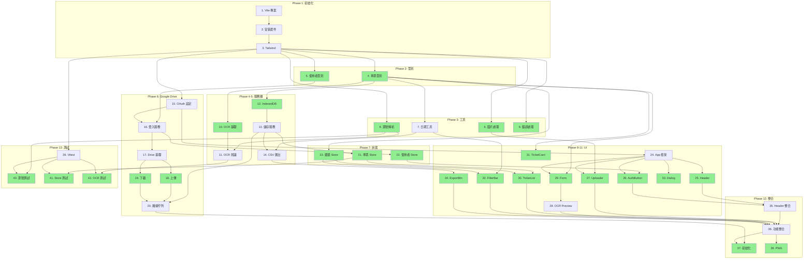

# Implementation Plan

## Task Overview
將高鐵車票管理工具拆解為原子化任務，採用由下而上的開發順序：先建立基礎設施（型別、工具），再建立服務層，最後整合 UI 元件。

## Atomic Task Requirements
**每個任務符合以下標準：**
- **File Scope**: 觸及 1-3 個相關檔案
- **Time Boxing**: 15-30 分鐘可完成
- **Single Purpose**: 單一可測試目標
- **Specific Files**: 明確指定檔案路徑

---

## Parallel Execution Guide

### 並行標記說明
- 🔄 **PARALLEL** - 可與同批次其他任務並行執行
- ⏳ **SEQUENTIAL** - 必須等待前置任務完成
- 🚀 **PARALLEL-START** - 並行批次的起點

### 執行批次總覽

```
Batch 1: [1] → [2] → [3]                    (順序執行)
Batch 2: [4] 🔄 [5]                          (並行)
Batch 3: [6] 🔄 [8] 🔄 [9] + [7]            (6,8,9 並行，7 依賴 4)
Batch 4: [10→11] 🔄 [12→13→14]              (兩條路徑並行)
Batch 5: [15] → [16] → [17] → [18] 🔄 [19] → [20]
Batch 6: [21] 🔄 [22] 🔄 [23]               (並行)
Batch 7: [24] → [25] 🔄 [26] 🔄 [27] 🔄 [29] 🔄 [30] 🔄 [31] 🔄 [32] 🔄 [33] 🔄 [34]
         + [28] (依賴 29)
Batch 8: [35] → [36] → [37] 🔄 [38]
Batch 9: [39] → [40] 🔄 [41] 🔄 [42]        (測試並行)
```

---

## Phase 1: 專案初始化
> ⏳ **SEQUENTIAL** - 必須按順序執行

- [x] 1. 初始化 Vite + React + TypeScript 專案
  - File: package.json, vite.config.ts, tsconfig.json
  - 執行 `npm create vite@latest . -- --template react-ts`
  - 確認 `npm run dev` 無錯誤輸出
  - _Requirements: 1.1, 1.2, 2.1, 3.1_

- [x] 2. 安裝專案相依套件
  - File: package.json
  - 安裝 UI: `tailwindcss postcss autoprefixer`
  - 安裝 狀態: `zustand`
  - 安裝 儲存: `dexie`
  - 安裝 OCR: `tesseract.js heic2any`
  - 安裝 Google: `@react-oauth/google`
  - _Requirements: 1.2, 3.1, 3.5_
  - _Depends: 1_

- [x] 3. 設定 Tailwind CSS
  - File: tailwind.config.js, postcss.config.js, src/index.css
  - 執行 `npx tailwindcss init -p`
  - 設定 content 路徑
  - 加入 Tailwind directives 到 index.css
  - _Requirements: NFR-Usability_
  - _Depends: 2_

---

## Phase 2: 型別定義
> 🚀 **PARALLEL-START** - 任務 4, 5 可並行執行

- [x] 4. 建立車票紀錄型別 🔄
  - File: src/types/ticket.ts
  - 定義 TicketRecord interface (id, ticketNumber, travelDate, travelTime, direction, departure, destination, purpose, syncStatus)
  - 定義 OCRResult interface (含 confidence, rawText)
  - 定義 FilterOptions interface (month, direction, searchText)
  - _Requirements: 1.2, 1.3, 1.4, 2.3, 2.4_
  - _Depends: 3_
  - _Parallel: 5_

- [x] 5. 建立使用者狀態型別 🔄
  - File: src/types/user.ts
  - 定義 UserState interface (isGoogleLoggedIn, googleUser, lastSyncTime)
  - 定義 GoogleUser interface (email, name, picture)
  - 定義 SyncStatus type ('synced' | 'pending' | 'local')
  - _Requirements: 3.1, 3.3, 3.6_
  - _Depends: 3_
  - _Parallel: 4_

---

## Phase 3: 工具函數
> 🚀 **PARALLEL-START** - 任務 6, 8, 9 可並行；任務 7 依賴任務 4

- [x] 6. 建立圖片處理工具 🔄
  - File: src/utils/imageUtils.ts
  - 實作 `convertHeicToJpg(file: File): Promise<File>` 使用 heic2any
  - 實作 `isValidImageFormat(file: File): boolean` 檢查 JPG/PNG/HEIC
  - 實作 `compressImage(file: File, maxWidth: number): Promise<File>`
  - _Requirements: 1.1, 1.6_
  - _Depends: 3_
  - _Parallel: 8, 9_

- [x] 7. 建立日期時間工具 ⏳
  - File: src/utils/dateUtils.ts
  - 實作 `formatDate(date: string): string` 格式化為 YYYY/MM/DD
  - 實作 `formatTime(time: string): string` 格式化為 HH:mm
  - 實作 `getMonthOptions(): Array<{value, label}>` 產生月份選項
  - 實作 `formatForCSV(ticket: TicketRecord): string` CSV 格式
  - _Requirements: 2.3, 2.4, 3.7_
  - _Leverage: src/types/ticket.ts_
  - _Depends: 4_

- [x] 8. 建立票號解析工具 🔄
  - File: src/utils/ticketParser.ts
  - 實作 `parseTicketNumber(text: string): string | null` 使用正規表達式提取 13 碼票號
  - 實作 `parseDirection(text: string): 'northbound' | 'southbound' | null` 判斷方向
  - 實作 `parseDateTime(text: string): {date, time} | null` 提取日期時間
  - 實作 `normalizeStation(name: string): string` 標準化站名
  - _Requirements: 1.2, 1.3, 1.4_
  - _Depends: 3_
  - _Parallel: 6, 9_

- [x] 9. 建立錯誤處理工具 🔄
  - File: src/utils/errorHandler.ts
  - 定義 AppError class 和錯誤類型 enum
  - 實作 `handleOCRError(error: Error): string` 回傳使用者友善訊息
  - 實作 `handleNetworkError(error: Error): string`
  - 實作 `handleGoogleAuthError(error: Error): string`
  - _Requirements: 1.5, 3.5, 3.6_
  - _Depends: 3_
  - _Parallel: 6, 8_

---

## Phase 4: 服務層 - OCR
> 🚀 **PARALLEL-START** - 可與 Phase 5 (任務 12-14) 並行執行

- [x] 10. 建立 OCR 服務基礎架構 🔄
  - File: src/services/ocrService.ts
  - 建立 OCRService class
  - 實作 `initialize(): Promise<void>` 初始化 Tesseract worker 並載入繁體中文語言包
  - 實作 `terminate(): Promise<void>` 釋放 worker 資源
  - _Requirements: 1.2_
  - _Depends: 4_
  - _Parallel: 12_

- [x] 11. 實作車票辨識邏輯 ⏳
  - File: src/services/ocrService.ts
  - 實作 `recognizeTicket(imageFile: File): Promise<OCRResult>`
  - 整合 ticketParser 解析辨識結果
  - 計算辨識信心度 (0-1)
  - _Requirements: 1.2, 1.3, 1.4_
  - _Leverage: src/utils/ticketParser.ts_
  - _Depends: 8, 10_

---

## Phase 5: 服務層 - 本機儲存
> 🚀 **PARALLEL-START** - 可與 Phase 4 (任務 10-11) 並行執行

- [x] 12. 建立 IndexedDB 資料庫結構 🔄
  - File: src/services/database.ts
  - 使用 Dexie.js 建立 TicketDatabase class
  - 定義 tickets 資料表 schema
  - 設定索引: ticketNumber, travelDate, syncStatus
  - _Requirements: 3.5_
  - _Leverage: src/types/ticket.ts_
  - _Depends: 4_
  - _Parallel: 10_

- [x] 13. 實作本機儲存服務 ⏳
  - File: src/services/storageService.ts
  - 實作 `saveTicket(ticket: TicketRecord): Promise<void>`
  - 實作 `getAllTickets(): Promise<TicketRecord[]>`
  - 實作 `updateTicket(ticket: TicketRecord): Promise<void>`
  - 實作 `deleteTicket(id: string): Promise<void>`
  - _Requirements: 3.5, 2.5, 2.6_
  - _Leverage: src/services/database.ts_
  - _Depends: 12_

- [x] 14. 實作 CSV 匯出功能 ⏳
  - File: src/services/storageService.ts
  - 實作 `exportToCSV(tickets: TicketRecord[]): string` 產生 CSV 內容
  - 實作 `downloadCSV(content: string, filename: string): void` 觸發下載
  - _Requirements: 3.7_
  - _Leverage: src/utils/dateUtils.ts_
  - _Depends: 7, 13_

---

## Phase 6: 服務層 - Google Drive
> ⏳ **SEQUENTIAL** - 15→16→17 必須順序；18, 19 可並行

- [x] 15. 設定 Google OAuth 憑證 ⏳
  - File: src/config/google.ts, .env.example, README.md
  - 定義 GOOGLE_CLIENT_ID 環境變數
  - 定義 GOOGLE_DRIVE_SCOPE 常數
  - 撰寫 Google Cloud Console 設定說明文件
  - _Requirements: 3.1, NFR-Security_
  - _Depends: 3_

- [x] 16. 實作 Google 登入服務 ⏳
  - File: src/services/googleAuthService.ts
  - 實作 `login(): Promise<GoogleUser>` 使用 @react-oauth/google
  - 實作 `logout(): Promise<void>`
  - 實作 `isAuthorized(): boolean`
  - 實作 `getAccessToken(): string | null`
  - _Requirements: 3.1, NFR-Security_
  - _Leverage: src/config/google.ts, src/types/user.ts_
  - _Depends: 5, 15_

- [x] 17. 建立 Google Drive 服務基礎架構 ⏳
  - File: src/services/googleDriveService.ts
  - 建立 GoogleDriveService class
  - 實作 `ensureFolder(): Promise<string>` 建立/取得 THSR-Ticket-Manager 資料夾
  - 實作 `findFile(name: string): Promise<string | null>` 搜尋檔案
  - _Requirements: 3.2_
  - _Leverage: src/services/googleAuthService.ts_
  - _Depends: 16_

- [x] 18. 實作 Google Drive 上傳功能 🔄
  - File: src/services/googleDriveService.ts
  - 實作 `uploadTickets(tickets: TicketRecord[]): Promise<void>` 上傳 tickets.json
  - 處理檔案不存在時建立、存在時更新
  - _Requirements: 3.3_
  - _Leverage: src/types/ticket.ts_
  - _Depends: 17_
  - _Parallel: 19_

- [x] 19. 實作 Google Drive 下載功能 🔄
  - File: src/services/googleDriveService.ts
  - 實作 `fetchTickets(): Promise<TicketRecord[]>` 下載 tickets.json
  - 處理檔案不存在時回傳空陣列
  - _Requirements: 3.4_
  - _Depends: 17_
  - _Parallel: 18_

- [x] 20. 實作離線同步佇列 ⏳
  - File: src/services/syncQueueService.ts
  - 實作 `addToQueue(ticket: TicketRecord): void` 加入待同步佇列
  - 實作 `processQueue(): Promise<void>` 處理佇列
  - 實作網路狀態監聽 (navigator.onLine + online/offline events)
  - _Requirements: 3.5, 3.6_
  - _Leverage: src/services/googleDriveService.ts, src/services/storageService.ts_
  - _Depends: 13, 18, 19_

---

## Phase 7: 狀態管理
> 🚀 **PARALLEL-START** - 任務 21, 22, 23 可並行執行

- [x] 21. 建立車票 Store 🔄
  - File: src/stores/ticketStore.ts
  - 使用 Zustand 建立 store
  - 定義 state: tickets, isLoading, error
  - 定義 actions: addTicket, updateTicket, deleteTicket, loadTickets
  - _Requirements: 2.1, 2.3, 2.5, 2.6_
  - _Leverage: src/services/storageService.ts, src/types/ticket.ts_
  - _Depends: 13_
  - _Parallel: 22, 23_

- [x] 22. 建立使用者 Store 🔄
  - File: src/stores/userStore.ts
  - 定義 state: isGoogleLoggedIn, googleUser, lastSyncTime
  - 定義 actions: login, logout, updateSyncTime
  - _Requirements: 3.1, 3.3_
  - _Leverage: src/services/googleAuthService.ts, src/types/user.ts_
  - _Depends: 16_
  - _Parallel: 21, 23_

- [x] 23. 建立篩選 Store 🔄
  - File: src/stores/filterStore.ts
  - 定義 state: month, direction, searchText
  - 定義 actions: setMonth, setDirection, setSearchText, clearFilters
  - 定義 computed: filteredTickets (搭配 ticketStore)
  - _Requirements: 2.4_
  - _Leverage: src/types/ticket.ts_
  - _Depends: 4_
  - _Parallel: 21, 22_

---

## Phase 8: UI 元件 - 基礎
> ⏳ 任務 24 必須先完成；25, 26 可並行

- [x] 24. 建立 App 主框架 ⏳
  - File: src/App.tsx, src/main.tsx
  - 設定 GoogleOAuthProvider
  - 建立基本頁面結構 (header, main, footer)
  - 套用 Tailwind 全域樣式
  - _Requirements: 3.1, NFR-Usability_
  - _Leverage: src/config/google.ts_
  - _Depends: 3, 15_

- [x] 25. 建立 Header 元件 🔄
  - File: src/components/Header.tsx
  - 顯示應用程式標題「高鐵車票管理」
  - 預留 GoogleAuthButton 位置
  - 顯示同步狀態圖示
  - _Requirements: NFR-Usability_
  - _Depends: 24_
  - _Parallel: 26, 27, 29, 30, 31, 32, 33, 34_

- [x] 26. 建立 GoogleAuthButton 元件 🔄
  - File: src/components/GoogleAuthButton.tsx
  - 未登入時顯示「使用 Google 登入」按鈕
  - 已登入時顯示使用者頭像、名稱、登出按鈕
  - 整合 userStore
  - _Requirements: 3.1_
  - _Leverage: src/stores/userStore.ts_
  - _Depends: 22, 24_
  - _Parallel: 25, 27, 29, 30, 31, 32, 33, 34_

---

## Phase 9: UI 元件 - 車票上傳
> 🚀 **PARALLEL-START** - 27, 29 可並行；28 依賴 29

- [x] 27. 建立 TicketUploader 元件 🔄
  - File: src/components/TicketUploader.tsx
  - 實作拖放上傳區域 (drag & drop)
  - 實作檔案選擇按鈕 (accept="image/*")
  - 手機版支援 capture="environment" 開啟相機
  - _Requirements: 1.1, 1.6_
  - _Leverage: src/utils/imageUtils.ts_
  - _Depends: 6, 24_
  - _Parallel: 25, 26, 29, 30, 31, 32, 33, 34_

- [x] 28. 建立 TicketOCRPreview 元件 ⏳
  - File: src/components/TicketOCRPreview.tsx
  - 左側顯示上傳的車票圖片
  - 右側顯示 OCR 辨識結果表單 (可編輯)
  - 底部確認/取消按鈕
  - _Requirements: 1.5, 2.2_
  - _Leverage: src/types/ticket.ts_
  - _Depends: 29_

- [x] 29. 建立 TicketForm 元件 🔄
  - File: src/components/TicketForm.tsx
  - 欄位: 票號、日期、時間、方向 (下拉)、起站、迄站、出差目的
  - 實作表單驗證 (票號 13 碼、日期格式)
  - 支援新增和編輯模式
  - _Requirements: 1.5, 2.2, 2.5_
  - _Leverage: src/types/ticket.ts_
  - _Depends: 4, 24_
  - _Parallel: 25, 26, 27, 30, 31, 32, 33, 34_

---

## Phase 10: UI 元件 - 車票清單
> 🚀 **PARALLEL-START** - 任務 30, 31, 32, 33 可並行執行

- [x] 30. 建立 TicketList 元件 🔄
  - File: src/components/TicketList.tsx
  - 使用 grid 或 flex 顯示 TicketCard 清單
  - 空狀態顯示「尚無車票紀錄，點擊上方新增」
  - 整合 ticketStore 和 filterStore
  - _Requirements: 2.3_
  - _Leverage: src/stores/ticketStore.ts, src/stores/filterStore.ts_
  - _Depends: 21, 23, 24_
  - _Parallel: 25, 26, 27, 29, 31, 32, 33, 34_

- [x] 31. 建立 TicketCard 元件 🔄
  - File: src/components/TicketCard.tsx
  - 顯示: 票號、日期、時間、方向箭頭、出差目的
  - 右上角顯示同步狀態標籤 (已同步/待同步/僅本機)
  - hover 時顯示編輯/刪除按鈕
  - _Requirements: 2.3, 2.5, 2.6_
  - _Leverage: src/types/ticket.ts_
  - _Depends: 4, 24_
  - _Parallel: 25, 26, 27, 29, 30, 32, 33, 34_

- [x] 32. 建立 FilterBar 元件 🔄
  - File: src/components/FilterBar.tsx
  - 月份選擇下拉選單 (最近 12 個月)
  - 方向篩選按鈕組 (全部/北上/南下)
  - 搜尋輸入框 (票號或目的)
  - _Requirements: 2.4_
  - _Leverage: src/stores/filterStore.ts, src/utils/dateUtils.ts_
  - _Depends: 7, 23, 24_
  - _Parallel: 25, 26, 27, 29, 30, 31, 33, 34_

- [x] 33. 建立 ConfirmDialog 元件 🔄
  - File: src/components/ConfirmDialog.tsx
  - Props: isOpen, title, message, onConfirm, onCancel
  - Modal 樣式對話框
  - 確認和取消按鈕
  - _Requirements: 2.6_
  - _Depends: 24_
  - _Parallel: 25, 26, 27, 29, 30, 31, 32, 34_

---

## Phase 11: UI 元件 - 匯出功能
> 🔄 **PARALLEL** - 可與其他 UI 元件並行

- [x] 34. 建立 ExportButton 元件 🔄
  - File: src/components/ExportButton.tsx
  - 顯示「匯出 CSV」按鈕
  - 點擊後呼叫 storageService.exportToCSV()
  - 顯示匯出成功 toast 訊息
  - _Requirements: 3.7_
  - _Leverage: src/services/storageService.ts_
  - _Depends: 14, 24_
  - _Parallel: 25, 26, 27, 29, 30, 31, 32, 33_

---

## Phase 12: 整合與優化
> ⏳ **SEQUENTIAL** - 35→36→37；38 可與 37 並行

- [x] 35. 整合 Header 區域 ⏳
  - File: src/App.tsx
  - 組裝 Header + GoogleAuthButton
  - 連接 userStore 顯示登入狀態
  - _Requirements: 3.1, NFR-Usability_
  - _Leverage: src/components/Header.tsx, src/components/GoogleAuthButton.tsx_
  - _Depends: 25, 26_

- [x] 36. 整合主要功能區域 ⏳
  - File: src/App.tsx
  - 組裝 TicketUploader + FilterBar + TicketList + ExportButton
  - 實作上傳完成後自動新增紀錄流程
  - _Requirements: 2.1, 2.3, 2.4_
  - _Leverage: src/components/*.tsx, src/stores/*.ts_
  - _Depends: 27, 28, 30, 32, 34, 35_

- [x] 37. 實作應用程式初始化流程 🔄
  - File: src/hooks/useAppInit.ts
  - 應用啟動時載入 IndexedDB 紀錄
  - 檢查 Google 登入狀態
  - 已登入則執行雲端同步
  - _Requirements: 3.2, 3.4, 3.5_
  - _Leverage: src/services/storageService.ts, src/services/googleDriveService.ts_
  - _Depends: 20, 36_
  - _Parallel: 38_

- [x] 38. 實作 PWA 支援 🔄
  - File: vite.config.ts, public/manifest.json, public/icons/
  - 安裝 vite-plugin-pwa
  - 設定 manifest (name, icons, theme_color)
  - 設定 service worker 快取策略
  - _Requirements: NFR-Performance_
  - _Depends: 36_
  - _Parallel: 37_

---

## Phase 13: 測試
> 🚀 **PARALLEL-START** - 任務 40, 41, 42 可並行執行（需先完成 39）

- [ ] 39. 設定 Vitest 測試框架 ⏳
  - File: vitest.config.ts, package.json
  - 安裝 vitest @testing-library/react @testing-library/jest-dom
  - 設定測試環境 (jsdom)
  - 加入 test script
  - _Requirements: NFR-Reliability_
  - _Depends: 3_

- [ ] 40. 建立票號解析單元測試 🔄
  - File: src/utils/__tests__/ticketParser.test.ts
  - 測試 parseTicketNumber: 正確票號、無效格式、空字串
  - 測試 parseDirection: 北上、南下、無法判斷
  - 測試 parseDateTime: 各種日期時間格式
  - _Requirements: 1.2, 1.3, 1.4_
  - _Leverage: src/utils/ticketParser.ts_
  - _Depends: 8, 39_
  - _Parallel: 41, 42_

- [ ] 41. 建立 Store 單元測試 🔄
  - File: src/stores/__tests__/ticketStore.test.ts
  - 測試 addTicket: 新增後 state 更新
  - 測試 updateTicket: 更新指定紀錄
  - 測試 deleteTicket: 刪除後移除
  - _Requirements: 2.1, 2.5, 2.6_
  - _Leverage: src/stores/ticketStore.ts_
  - _Depends: 21, 39_
  - _Parallel: 40, 42_

- [ ] 42. 建立 OCR 相容性測試 🔄
  - File: src/services/__tests__/ocrService.test.ts
  - 測試紙本車票圖片辨識 (使用測試圖片)
  - 測試 T-EX App 電子票截圖辨識
  - 測試辨識失敗的錯誤處理
  - _Requirements: NFR-Compatibility, 1.5_
  - _Leverage: src/services/ocrService.ts_
  - _Depends: 11, 39_
  - _Parallel: 40, 41_

---

## Task Summary

| Phase | 任務數 | 並行機會 | 說明 |
|-------|--------|----------|------|
| 1. 專案初始化 | 3 | ❌ 順序 | Vite + 相依套件 + Tailwind |
| 2. 型別定義 | 2 | ✅ 2 並行 | TypeScript interfaces |
| 3. 工具函數 | 4 | ✅ 3 並行 | 圖片處理、日期、票號解析、錯誤處理 |
| 4. OCR 服務 | 2 | ✅ 與 Phase 5 並行 | Tesseract.js 整合 |
| 5. 本機儲存 | 3 | ✅ 與 Phase 4 並行 | IndexedDB + CSV 匯出 |
| 6. Google Drive | 6 | ✅ 2 並行 | OAuth + 資料夾 + 上傳 + 下載 + 離線佇列 |
| 7. 狀態管理 | 3 | ✅ 3 並行 | Zustand stores |
| 8. UI 基礎 | 3 | ✅ 2 並行 | App + Header + Auth |
| 9. UI 上傳 | 3 | ✅ 2 並行 | 上傳 + OCR 預覽 + 表單 |
| 10. UI 清單 | 4 | ✅ 4 並行 | 清單 + 卡片 + 篩選 + 對話框 |
| 11. UI 匯出 | 1 | ✅ 與 UI 並行 | 匯出按鈕 |
| 12. 整合 | 4 | ✅ 2 並行 | Header 整合 + 功能整合 + 初始化 + PWA |
| 13. 測試 | 4 | ✅ 3 並行 | Vitest 設定 + 單元測試 + 相容性測試 |
| **總計** | **42** | **最多 10 並行** | |

---

## Dependency Graph



**圖例**: 🟢 綠色 = 可並行任務
